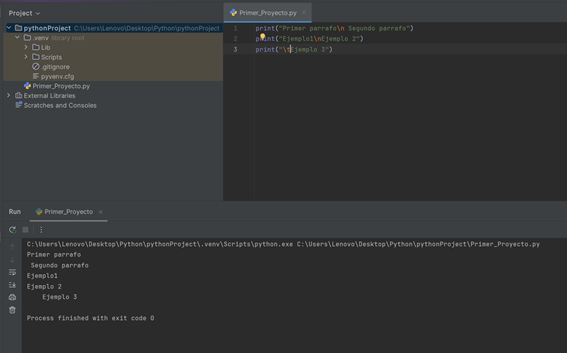

# Strings en Python  

## Índice
1. [¿Qué son los strings o cadenas de texto?](#qué-son-los-strings-o-cadenas-de-texto)
2. [Impresión de texto con `print`](#impresión-de-texto-con-print)
3. [Uso de comillas en strings](#uso-de-comillas-en-strings)
4. [Operaciones matemáticas dentro de `print`](#operaciones-matemáticas-dentro-de-print)
5. [Caracteres de escape](#caracteres-de-escape)
6. [Ejemplos de `input` con casos prácticos](#ejemplos-de-input-con-casos-prácticos)

## ¿Qué son los strings o cadenas de texto?
Los strings son cadenas de texto que nos sirven para indicar mediante la doble comilla "" o comillas simples '' donde empiezan y donde terminan.

Veamos algunas declaraciones.

> **Consejo**: Recuerda siempre probar tu código en un entorno de desarrollo como PyCharm o Jupyter Notebook.

[Pdt: Utilicé PyCharm para probar el código.](https://www.jetbrains.com/es-es/pycharm/download/?section=windows)

## Impresión de texto con print

Ejemplos:
```python
print("hola mundo")
```
## Uso de comillas en strings

Sin embargo, para poner comillas dentro de las comillas puedo jugar con ambos tipos para que no se me malogre el código. Si pongo comillas dobles("") dentro de comillas dobles("") entonces el lenguaje cree que estoy terminando y empezando una nueva cadena de texto.

```python
print("Me gusta estudiar 'python'")
```


En caso contrario, podemos poner una barra invertida \ antes de un caracter para desactivarlo y lo pase como texto. Ejemplo:
```python
print("Mi nombre es \"Begonia\"")
```


## Operaciones matemáticas dentro de `print`
Asimismo, también hace operaciones matemáticas y bastaría con ponerlos dentro del paréntesis. Por ejemplo:
```Python
print(77+700)
```


## Caracteres de escape
Para agregar, también tenemos las barras de líneas con las siguientes propiedades:


- \n: representa un salto de línea
- \t: representa una tabulación horizontal

Ejemplo 1:
Si quiero mostrar algo como
```
Línea 1
Línea 2
Línea 3
```
Entonces podría hacer lo siguiente:
```python
print("Línea 1\nLínea 2\nLínea3")
```

Ejemplo 2:

Si quiero mostrar algo como
```
A   B   C
D   E   F
G   H   I
```
Entonces podría hacer lo siguiente:
```python
print("A\tB\tC")
print("D\tE\tF")
print("G\tH\tI")
```



## Ejemplos de `input` con casos prácticos
La declaración *Input* nos sirve para que el usuario pueda introducir sus propios datos.

Por ejemplo, solicitemos al usuario su nombre y apellido:

```python
input("Escribe tu nombre: ")
input("Escribe tu apellido: ")
```
El sistema detiene el flujo del programa hasta que el usuario introduce un valor y luego finaliza el código.


Sin embargo, esto no es muy eficiente ya que el sistema luego de esto es como si se hubiera olvidado de lo que acabamos de ingresar, por lo que usaremos `print` sobre `input` para que nos devuelva este dato.


Veamos un ejemplo con una fábrica de telas en las que solicita información al usuario para conocer la colección.

1. Primero, para entenderlo de una manera más amigable, lo que podemos hacer es mostrar en una sola fila aquello que queremos mostrar
```python
print("La colección es respuesta1 respuesta2")
```

2. Segundo, podemos reemplazar estas respuestas por 
```python
print("La colección es " + input("¿Qué tipo de tela es?") + " " + input("¿En qué año se salió esta tela?"))
```

3. Asimismo, se estaba sugiriendo un salto de línea y con la comilla simple ' 
```python
print("La colección es\n'" + input("¿Qué tipo de tela es?") + " " + input("¿En qué año se salió esta tela?") + "'\n¡Gracias por consultar!")
```


¡Espero que te haya servido!

*Realizado por, Begonia Vela*
